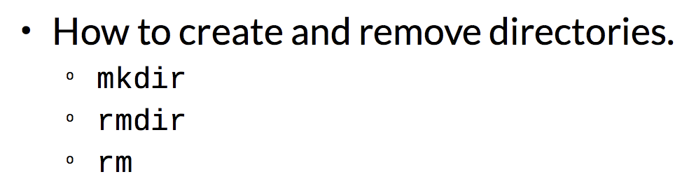
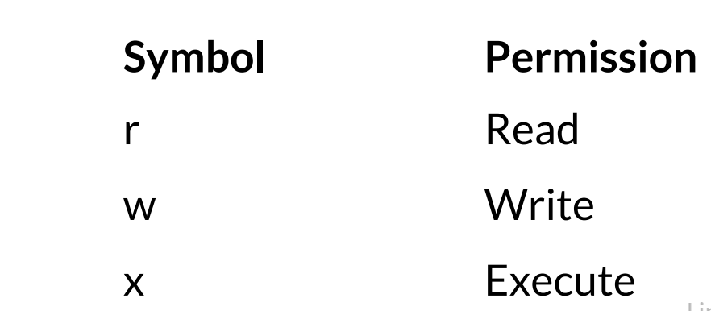
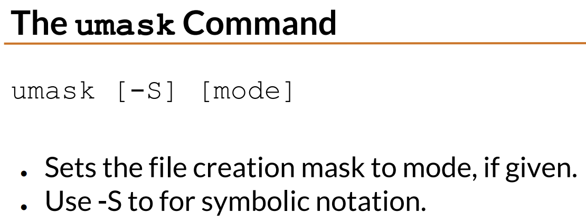
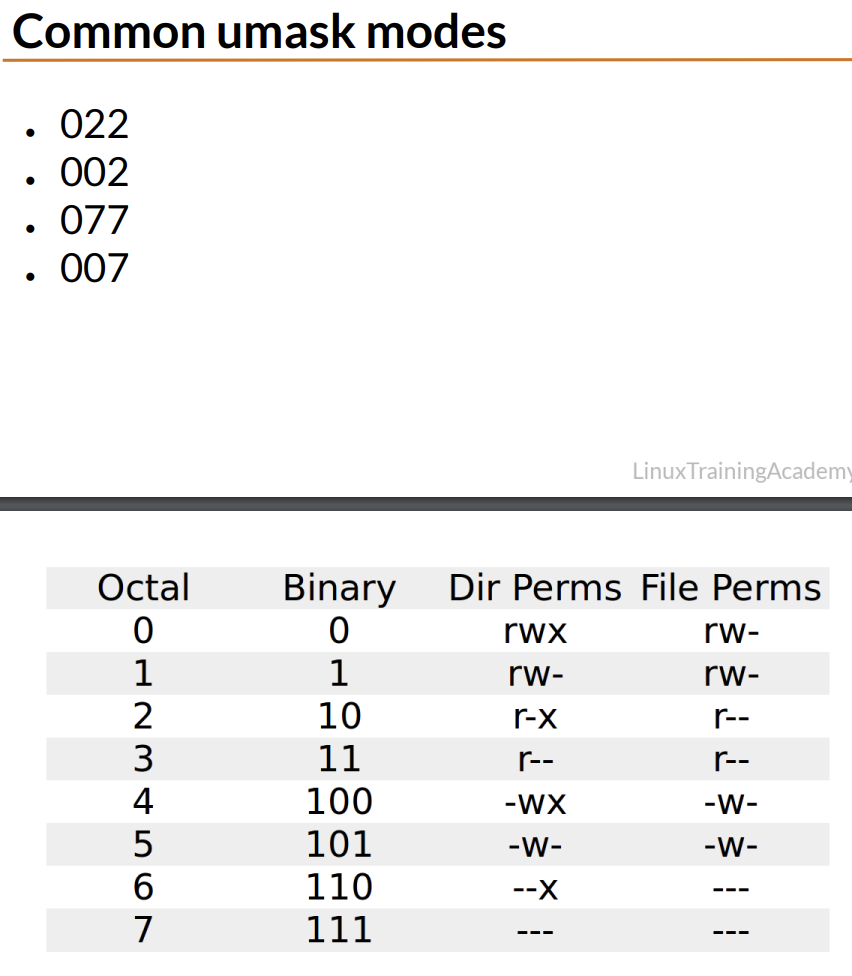
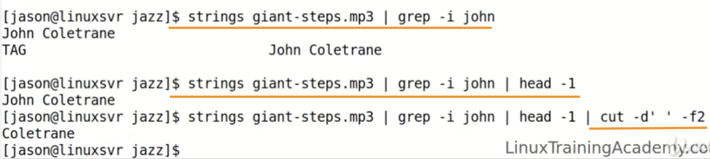
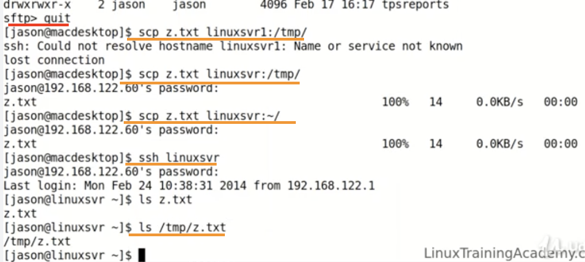
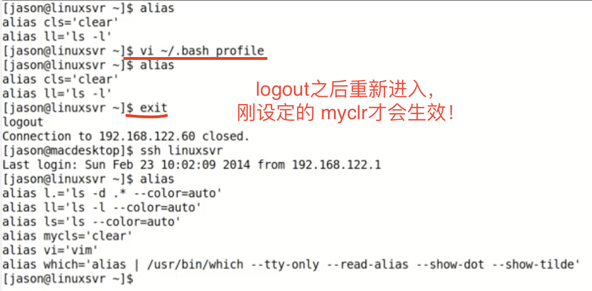
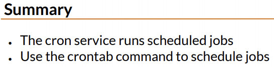
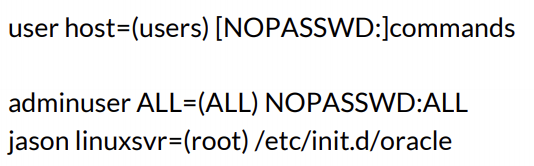
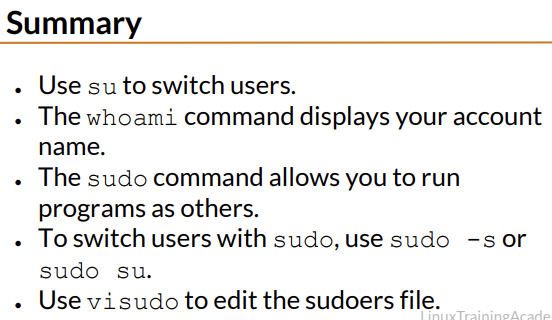

# Linux in 5 Days

-------------------

-------------------

### Day 1

* Background and Intro
* Linux Distribution
* Getting Connected
* Connect Directly

-------------------

#### What is Linux?

	+ An Operating System

	> Operating System is simply a collection of software that manages hardware resources and provides an environment where application can run.

	+ A Kernal

	+ Created by Linus Torvalds in 1991

	> _Linus Benedict Torvalds_ is a Finnish-American software engineer who is the creator, and historically, the principal developer of the Linux kernel, which became the kernel for operating systems such as the Linux operating systems, Android, and Chrome OS.

	+ First version released in 1994

	+ FOSS ( Free/Open Source software ）

	+ Unix-Like

	> Linux is not a UNIX derivative, it was written from scratch.

​
>> Linux起源于一个学生的简单需求。Linus Torvalds,Linux的作者与主要维护者，在其上大学时所买得起的唯一软件是Minix. Minix是一个类似Unix，被广泛用来辅助教学的简单操作系统。Linus 对Minix不是很满意，于是决定自己编写软件。他以学生时代熟悉的Unix作为原型， 在一台Intel 386 PC上开始了他的工作。他的进展很快，受工作成绩的鼓舞，他将这项成果通过互连网与其他同学共享，主要用于学术领域。有人看到了这个软件并开始分发。每当出现新问题时，有人会立刻找到解决办法并加入其中，很快的， Linux成为了一个操作系统。值得注意的是Linux并没有包括Unix源码。它是按照公开的POSIX标准重新编写的。Linux大量使用了由麻省剑桥免费软件基金的GNU软件，同时Linux自身也是用它们构造而成。

> 两大区别：1） UNIX系统大多是与硬件配套的，而Linux则可运行在多种硬件平台上.　2）UNIX是商业软件(5万美元)，而Linux是自由软件，免费、公开源代码的。　　
>> [历史] Unix的历史久于linux. Linux的思想源于Unix　　[产品]　UNIX和linux都是操作系统的名称．但unix这四个字母除了是操作系统名称外，还作为商标归SCO所有．  [商业化]   Linux商业化的有RedHat Linux 、SuSe Linux、slakeware Linux、国内的红旗等，还有Turbo Linux；　Unix主要有Sun 的Solaris、IBM的AIX,　HP的HP-UX，以及x86平台的的SCO Unix/Unixware

-------------------

#### Linux Distributions(发行版)

	+ Linux Kernal Plus Additional Software
	+ Each Distribution can have a different focus
	+ Many distributions available to choose from

		- DistroWatch.com
		- Red Hat Enterprise Linux (RHEL)
		- Fedora
		- Ubuntu
		- Debian
		- SuSE Linux Enterprise Server (SLES)
		- Open SuSE

-------------------

#### Why Linux?

	+ Run on many hardware platforms (phone, personal computers, super computers...)

	> Proprietory UNIX OS typically only run on their hardware from their company. (eg, UP-UX only runs on HP servers, AIX only runs on IBM servers.)  
	>> Linux can run on HP, IBM and other servers.

	+ Small Footprint (小型化)
	+ Stable, Reliable, Secure (稳定、可靠、安全)
	+ Great for servers
	+ FOSS

-------------------

> CentOS, it's really RedHat with the branding and logos replaced with CentOS branding

-------------------

* Linux is Linux

	+ Linux concepts are universal
	+ Each distro is slightly different
	+ Can accomplish the same goal on most Linux distro
	+ You can't make a "wrong" choice

-------------------

* VirtualBox Troubleshooting Tips
	

-------------------

#### Getting Connected

* Connecting Directly
	+ Log into the GUI -- open up a terminal

* Connecting Over the Network
	+ SSH (allow to connect from one system to another system securely over a network)
	+ Most popular SSH client:
		+ Windows - PuTTY
		+ Mac - Terminal / ssh command line utility

> __Secure Shell (SSH)__ is a cryptographic network protocol(密码写的网络协议) for operating network services securely over an unsecured network. The standard TCP port for SSH is 22. The best known example application is for remote login to computer systems by users.
>> In the past, used Telnet, which is typically obsolete today.  SSH has replaced Telnet as its more secure counterpart. Might encounte Telnet when connect to legacy system.
>>> TCP/IP, or the Transmission Control Protocol/Internet Protocol, is a suite of communication protocols used to interconnect network devices on the internet. TCP/IP can also be used as a communications protocol in a private network (an intranet or an extranet).

-------------------

* Connect directly to the Virtual Machine.
	+ Start virtualbox
	+ Start the virtual machine
	+ Type into the window to interact directly with the VM

* Connecting to a Virtual Machine over the Network
	###At the end of the course ###

-------------------

### Day 2

* Linux directory structure
* The Shell
* Basic Linux Commands
* Working with directories
* Listing files and Understanding ls output

-------------------

#### Common Diractories

__/__ 	 	“Root,” the top of the file system hierarchy.

__/bin__	Binaries and other executable programs.
> Some application you can run are sometimes located in  __/bin__

__/etc__ 	System configuration files.

__/home__ Home directories.
> __/home__ directory is where you can separate your data from another account's data

__/opt__ Optional or third party software.
> __/opt__ is for software that is not bundled with the operating system

__/tmp__ Temporary space, typically cleared on reboot.

__/usr__ User related programs.

__/var__ Variable data, most notably log files.
>> __log file__ 日志文件  In computing, a log file is a file that records either events that occur in an operating system or other software runs, or messages between different users of a communication software. Logging is the act of keeping a log.

> Each of these directories can have directories!

> __File Transfer Protocol(FTP)__ is a standard network protocol used for the transfer of computer files between a client and server on a computer network or between two computers over a network and Internet.

> 

-------------------

> crashplan is backup software that's not bundled with the Linux operating system. If u install it from their website, it would install into _user/local/crashplan_.

-------------------

-------------------

> __A command-line interface or command language interpreter (CLI)__, also known as _command-line user interface_, console user interface and character user interface (CUI), is a means of interacting with a computer program where the user (or client) issues commands to the program in the form of successive lines of text (command lines). _A program which handles the interface is called a __command language interpreter__ or __shell__ (computing)._

-------------------

> __Dollar sign（$）__: This is an indication that you're using the system as a __normal user__ as opposed to a super user.

> __Pound sign (#)__: The superuser on a Linux system is also called __root__, it's __an account called root__ .
>> The root account on Linux is similar to an administrator account on a Window system.

>>> Root: 1. superuser account! 2. The beginning of file system

-------------------

> day to day activities(日常活动)

-------------------

* Prompt可以单行，也存在多行。

-------------------

> Tilde(~)
>> Tilde is a shortcut for __home__

-------------------

-------------------

> _ls Option_, __-l long listing format__

> __cd 单独使用时，会返回到 home directory__

> __cat__ will display the contents of files

> __echo__ is used to display the contents of variables

>> 

> __man__ to learn more information about how to use a particular command

>> 

-------------------

-------------------

* PATH

	+ An environment variable
	+ Controls the command search path
	+ Contains a list of directories

* echo $OLDPWD:
	OLDPWD, this environmental variable holds the directory that you were previously in

-------------------

* Which: Locate a command
	

> 当存在多个相同名字的目标文件时，执行哪一个文件取决于路径 search path。which ever directory occurs first in your path will be the cat command that get executed.

* Searching Man Pages
	+ man -k SEARCH_TERM
		

-------------------

-------------------

#### Directories

+ Are Containers for other files and directories.
+ Provide a tree like structure.
+ Can be accessed by name or shortcut.

#### Directory Shortcuts

* __.__	 This directory
	 __..__	 The parent directory
* __cd -__ Change to the previous directory
>  echo $OLDPWD, environmental variable which could holds the directory that you were previously in

> If type cd space and a dash enter, you'll be placed into your previous directory  

* __/__ Directory separator (forward slash)

-------------------

-------------------

#### Creating and Removing Directories

> `rm -rf directory` 使用需要慎重，会删除当前及以下的所有，且不可逆。

-------------------

-------------------

> __ls -l -a__ = __ls -la__ = __ls -al__

-------------------

##### Listing File by Type
`ls -F`

-------------------

#### Symbolic Links

* A link is a points to the actual file or directory.
* Use the link as if it were the file.
* A link can be used to create a shortcut.
	+ Use for long file or directory names.
	+ Use to indicate the current version of software.

> Linux链接分两种，一种被称为硬链接，另一种被称为符号链接。默认情况下，ln命令产生硬链接。
>> __硬连接（Hard Link)__ , 指通过索引节点来进行连接。在Linux的文件系统中，保存在磁盘分区中的文件不管是什么类型都给它分配一个编号，称为索引节点号(Inode Index)。在Linux中，多个文件名指向同一索引节点是存在的。一般这种连接就是硬连接。
>>> __硬连接的作用__ 是允许一个文件拥有多个有效路径名，这样用户 就可以建立硬连接到重要文件，以防止“误删”的功能。其原因如上所述，因为对应该目录的索引节点有一个以上的连接。只删除一个连接并不影响索引节点本身和 其它的连接，只有当最后一个连接被删除后，文件的数据块及目录的连接才会被释放。也就是说， _文件真正删除的条件是与之相关的所有硬连接文件均被删除。_

>> __符号连接（Symbolic Link）, 也叫软连接__ ，软链接文件有类似于Windows的快捷方式。它实际上是一个特殊的文件。在符号连接中，文件实际上是一个文本文件，其中包含的有另一文件的位置信息。
>>> A __symbolic link, also termed a soft link__, is a special kind of file that points to another file, much like a shortcut in Windows or a Macintosh alias. Unlike a hard link, a symbolic link does not contain the data in the target file. It simply points to another entry somewhere in the file system.

-------------------

#### Listing Files

* __ls -t__: 		List files by time.
	 __ls -r__: 		Reverse order.
	 __ls -latr__: 	Long listing including all files reverse sorted by time.
* __ls -R : Lists files recursively__
* __ls -d : List directory name, not contents.__
* __ls --color : Colorize the output__

> ls 后面的命令(如"-F, -t, -r..."等都是可以组合的）

-------------------

#### The tree Command

> Similar to ls -R, but creates visual output.

* __tree -d__: List directories only.
* __tree -C__: Colorize output

>> Tree is on a lot of Linux distributions, it may not be installed by default.

-------------------

#### Working with Spaces in Names

* Just say no to spaces!
* Alternatives:
	+ Hyphens ( - )
	+ Underscores ( _ )
	+ CamelCase
	+ Encapsulate the entire file name in quotes.
	+ Use a backslash (\) to escape spaces.

	> __Camel case__ (stylized as camelCase or CamelCase; also known as camel caps or more formally as medial capitals) is the practice of writing compound words or phrases such that each word or abbreviation in the middle of the phrase begins with a capital letter, with no intervening spaces or punctuation.
	>> _Example_: "ComputerHope", "FedEx", and "WordPerfect" are all examples of CamelCase. In computer programming CamelCase is often used as a naming convention for naming variables, arrays, and other elements.

> my notes.txt 中存在空格，需要使用特殊办法。
>> Double/Single quote; dash (my-notes.txt); underscore (my_notes.txt); CamelCase (MyNotes.txt / myNotes.txt)

-------------------

-------------------

#### Quiz

3. Where are log files typically found on a Linux system?
---- __/var/logs__

4. What directory would you expect to find user home directories?
---- __/home__

5. Shell prompts look the same on every Linux system.
---- __/False__

9. Which command displays the built-in documentation on a Linux system?
---- __/man__

-------------------

### Day 3

* File and Directory permissions
* View files and the Nano Editor
* Editing files in Vi
* Vi cheat sheet
* Emacs cheat sheet
* Finding files and Directories
* Graphical Editors

-------------------

> u -- User that owns the file.

> g -- Group, the users that are in the file's group

> o -- Other, users that are not the owner or are not in the file's group

> a -- All, everybody

> 
>> "groups" 和 "id -Gn" 效果相同，可以得到当前所在的所有 groups
>>> "groups XX" 可以得到 XX 所在的 groups

> __Order是有意义的，因此遵循 "Type--User--Group--Other" 的顺序！In perimission, order has meaning!__

-------------------

#### Changing Permissions

> 
>> 使用 __"chmod"__ 改变permission, u/g/o/a表示要改变的部分，+-=表示所要改变的状态。
>>> 当= 后面没有接上 rwx时，表示没有任何权限！ a同时表示"ugo"！ 不同的类型中间用"逗号,"分隔。

> Octal Mode 八进制模式

> Coommonly Used Permissions

-------------------

#### Working with Groups

* New files belong to your primary group.
* The `chgrp` command changes the group.

	> 

-------------------

#### Directory Permissions Revisited

* Permissions on a directory can effect the files
in the directory.
* If the file permissions look correct, start
checking directory permissions.
* Work your way up to the root.

>>> 

-------------------

#### File Creation Mask (文件创建掩码)

* __File creation mask determines default permissions__
* If no mask were used permissions would be:
	+ 777 for directories
	+ 666 for files

> 当我们登录系统之后创建一个文件总是有一个默认权限的，那么这个权限是怎么来的呢？这就是umask干的事情。umask设置了用户创建文件的默认权限，它与chmod的效果刚好相反，umask设置的是权限“补码”，而chmod设置的是文件权限码。

> `umask -S`, for symbolic notation

>> `umask` 和 `chmod` 相反。 __chmod 为7(rwx / all permissions); umask 为7 (no permissions / all permissions off)__

>>> 

>> 

>> 

> Special Modes

> The `touch` command either creates a file if it doesn't exist or it updates the time stamp of a file.

-------------------

#### Displaying the Contents of Files

* `cat file` Display the contents of file.
* `more file` Browse through a text file.
* `less file` More features than more.
* `head file` Output the beginning (or top) portion of file.
* `tail file` Output the ending (or bottom) portion of file.

##### Head and Tail

* Displays only 10 lines by default
* Change this behavior with -n
	+ n = number of lines
	+ tail -15 file.txt
	> To see the last 15 lines of the file
>> 默认状态下， head tail都只可以看10行。
>>> head -3 (前3行)； tail -3 (后3行)

##### Viewing Files in Real Time

* `tail -f file` Follow the file.
* Displays data as it is being written to the file.

-------------------

#### Nano Editor

* Nano is a simple editor.
* Easy to to learn.
* Not advanced and vi or emacs.
* If nano isn't available, look for pico.

> 使用的时候，`$ nano file.txt` 即可。 Arrow key(down, up, left, right) works in Nano editor. _"Ctrl + G" to get help_

>> GNU nano is a text editor for Unix-like computing systems or operating environments using a command line interface. It emulates the Pico text editor, part of the Pine email client, and also provides additional functionality.

-------------------

#### The Vi Editor

* Has advanced and powerful features
* Not intuitive
* Harder to learn than nano
* Requires a time investment

* `vi [file]` Edit file.
* `vim [file]` Same as vi, but more features.
* `view [file]` Starts vim in read-only mode.

-------------------

##### Vi Command Mode and Navigation

##### Vi Insert Mode

##### Vi Line Mode

-------------------

> Vi Modes

* Vi
	+ Repeating Commands
	+ Deleting Text
	+ Change Text
	+ Copying and Pasting
	+ UnDo / Redo
	+ Searching

> Vi Cheat Sheet

-------------------

#### Emacs Editor

* Emacs is Powerful editor.
* Some people prefer vi, other emacs.
* Either are great editors.
* Use what feels comfortable to you.

-------------------

* `emacs [file]` Edit file.
* `C-<char>` Ctrl while pressing <char>.
* `M-<char>` "Meta" key (alt key) while pressing <char>.
* `M-<char>` Esc, then type <char>

-------------------

* Emacs

	+ Repeating Commands
	+ Deleting Text
	+ Change Text
	+ Copying and Pasting
	+ UnDo / Redo
	+ Searching

-------------------

#### Finding Files and Directories

* The __find__ Command

	+ `find [path…] [expression]`

	> Recursively finds files in path that match expression. __If no arguments__ are supplied it find __all files__ in the current directory

	+ find Options
		
		> 在`$ find /sbin -name/ -iname` 的 `pattern`中如果使用 __"* means everythings"__

		
		> eg. `$ find . -mtime +10 -mtime -10`, `$ find . -size +1M`, `$ find . -type d -newer file.txt`

* A Fast Find - __locate__

	+ `locate pattern`
	+ Lists files that match pattern.
	+ Faster than the `find` command.
	+ Queries an index.
	+ Results are not in real time.
	+ May not be enabled on all systems.

> `locate` 可以快速找出 pattern 相关目标。但是没有找出touch之后的 `new-file`，因为没有及时更新
>> `touch` 创建或更新。either creates a file if it doesn't exist or it updates the time stamp of a file.
>>> 

-------------------

#### Graphical Editors

* emacs	--		Emacs has a graphical mode too.
	 gedit 	--		The default text editor for Gnome.
	 gvim 	--		The graphical version of vim.
	 kedit 	--		The default text editor for the KDE.

	 AbiWord --		Microsoft Word alternative.
	 LibreOffice		-- Full office suite.
	 Kate 	--		Source code editor.

-------------------

### Day 4

* Deleting, Copying, Moving and Renaming Files
* Wildcards
* Input, Output and Redirection
* Comparing Files
* Searching In Files and Pipes
* Transferring and Copying Files over the Network
* Customizing the Shell Prompt
* Shell Aliases

-------------------

#### Removing Files

* `rm file`		Remove file.
	 `rm -r dir`	   Remove the directory and its contents recursively.
	 `rm -f file`	 Force removal and never prompt for confirmation.

> rm -rf directory

-------------------

#### Copying Files

* `cp source_file destination_file` -----	Copy source_file to destination_file.

	 `cp src_file1 [src_fileN ...] dest_dir` ----	Copy source_files to destination_directory.
	+ `cp` Options
		- `cp -i` --	Run in interactive mode.
		- `cp -r source_directory destination` --  Copy src_directory recursively to destination.

> `$ diff XX1 XX2`, to see what's difference between XX1 and XX2

-------------------

#### Moving and Renaming Files

* `mv` --		Move or rename files and directories.
	 `mv source destination`	--		Move source into destination / rename the source to destination / overwrite destination

> source将会消失不见。更名为destination.

* `mv -i source destination`  --		If destination exist, mv will ask you if you want to overwrite the destination

	

-------------------

#### Sorting Data

* `sort file` --	 Sort text in file.

> 按照字母等最基础的排序

* sort Options
	+ `-k F`	--	 Sort by key. F is the field number.
		 `-r`	--	 Sort in reverse order.
		 `-u`	--	 Sort unique

	> `-u`remove duplicate lines and only provides unique results
	>>> 
	>>> 

-------------------

#### Creating a Collection of Files

* `tar [-] c|x|t f tarfile [pattern]`	--  Create, extract or list contents of a tar archive using pattern, if supplied.

* tar Options
	+ `c`	--	 Create a tar archive.
		 `x`	--	 Extract files from the archive.
		 `t`	--	 Display the table of contents (list).
		 `v`	--	 Be verbose.
		 `z`	--	 Use compression.
		 `f file`	--	 Use this file.

-------------------

#### Compressing Files To Save Space

* `gzip`	--	 Compress files.
	 `gunzip`	--	 Uncompress files.
	 `gzcat`	--	 Concatenates compressed files.
	 `zcat`	--	 Concatenates compressed files.

-------------------

#### Disk Usage

* `du`	--	 Estimates file usage
	 `du -k`	--	 Display sizes in Kilobytes
	 `du -h`	--	 Display sizes in human readable format

>> eg. If the file is 5 megabytes, it will say 5M.

-------------------

#### Wildcards (通配符)

##### Two main wildcards: Asterisk & Question mark
> 
>> "* for 0-more char; ? for 1 char!"

##### Character Classes

>>> [ ] 中的 __一个__ 字符！

##### Ranges

##### Name Character Classes

> __[[:alpha:]]__ -- Matches alphabetic letters, both __lower and upper case letters.__

> __[[:alnum:]]__	-- Matches alphanumeric characters, __alpha and digits__, (upper and lower case letters and all decimal digits)

> __[[:digit:]]__	--	Matches __number 0-9__

> __[[:lower:]]__	--	Matches __any lower case letters__

> __[[:space:]]__	--	Matches white space, __spaces, tabs and newlines characters__

> __[[:upper:]]__	--	Matches __only upper case letters__

-------------------

##### Escape Character -- Back slash \

> `*|?` -- 寻找以 '?'结尾的. （eg. 可能得到 "done?"）

-------------------

#### Input/Output Types

#### Redirection

* `>` Redirects standard output to a file. Overwrites (truncating) existing contents.
* `>>` Redirects standard output to a file. Appends to any existing contents.
* `<` Redirects input from a file to a command.
* `&` (ampersand & ) Used with redirection to signal that a file descriptor is being used.
* `2>&1` Combine stderr and standard output.
* `2>file` Redirect standard error to a file.

> Input and Output redirection can be combined.

#### The Null Device

-------------------

#### Comparing Files

* Comparing the Contents of Files

	+ `diff file1 file2` Compare two files.
	+ `sdiff file1 file2` Side-by-side comparison.
	+ `vimdiff file1 file2` Highlight differences in vim.

* `diff` Output
	
	

	 Three dash（---) are just for separate

> 
>> "4c4" means the fourth line of the first file is changed or different than the fourth line of the second file.

* `sdiff` Output
	

> 
>> `echo new last line >> secret`是在 secret加入了一行“new last line”

* `vimdiff`
	

> 
>> Type `vimdiff secret secret.bak` 进入

-------------------

#### Searching in File using pipes

##### The __grep__ Command
+ `grep` Display lines matching a pattern.
+ `grep pattern file`

+ grep Options:
	- `-i`	--	 Perform a search, ignoring case.
		 `-c`	--	 Count the number of occurrences in a file.
		 `-n`	--	 Precede output with line numbers.
		 `-v`	--	 Invert Match. Print lines that don’t match.

	> `grep -v o filename` 会在filename文件中寻找 不包含'o'的目标！

-------------------

##### The __file__ Command

* `file file_name`	--	 Display the file type

-------------------

##### Searching for Text in Binary Files

* `strings` Display printable strings.

> Bianry file is a machine readable file, not human readable fomat.
>> If you run `grep` against a binary file, it will simply display whether or not that information was found in the file, but it will not display the text.
>>> Too look at the textual data within a binary file, use the `strings` command.

-------------------

##### Pipes

* `|`	--	 Pipe symbol.
	+ __Can chain two commands together with a pipe!__
	+ Another use of pipes is to __control how output is displayed to your screen.__

		> If a command produces a significant amount of output it can scroll off your screen before you have a chance to view it. To control the output, use a pager utility such as `more` or `less`

* `command-output | command-input`

* `grep pattern file` __=__ `cat file | grep pattern` 作用相同！
> Because `cat` display contents of the file on standard output, the `pipe` takes the standard output from the `cat` command and passes it in as a standard input to the `grep` command. Since no file name was specified for `grep` to act on, it takes standard input as its input.

-------------------

##### The __cut__ Command

* `cut [file]`	--	 Cut out selected portions of file. If file is omitted, use standard input.
* cut Options
	+ `-d delimiter`	--	 Use delimiter as the field separator.
		 `-f N`	--	 Display the Nth field.

>> sort 排序
>>> Eg. 

> __tr "x" "y"__ translate "x" into "y"
>> Use the `column` command with a `-t`for table to display information in a table format,
>>> 

* To control the output, use a pager utility such as `more` or `less`

-------------------

#### Copying Files over the Network

> `cp` command can copy file on the same system. But if want to copy files from local work station to a Linux server or between Linux servers, need to use `SCP` and `SFTP`

* `SCP` -- Secure copy
* `SFTP` -- SSH file transfer protocol

>> In order to use `SCP` or `SFTP`, you need a client. Mac and Linux come with scp and sftp command line utilities. Windows use PuTTY.

* `scp`
* `sftp`
* PuTTY Secure Copy client - `pscp.exe`
* PuTTY Secure File Transfer client - `psftp.exe`

-------------------

* Graphical SCP/SFTP Clients
	+ Cyberduck	--	popular for Mac & Windows
		 FileZilla	--	 runs on Mac & Windows & Linux
		 WinSCP	-- it's a Windows only SCP and SFTP client

-------------------

##### scp / sftp command line utilities

* `scp source destination`	--	Copy source to destination.
	 `sftp host`	--	Start a secure file transfer session with host.
* `sftp jason@host`

> If looking for a more interactive experience where can examine the local files and remote files, use __SFTP__
>> With __SCP__, need to know what file you want to transfer before issuing the command.

##### __ftp__ Command Line Utility

* `ftp host`	--	Start a file transfer session with host.

> __`ftp` is not a secure transfer protocol like SCP and SFTP.__ This means your login credentials are sent in plain text over the network. Also the files you upload and download are not encrypted either. __因此，优先使用 `SCP` 和 `SFTP`__

> 
>> lpwd says that I'm in the local tmp test directory.

>> lls, shows what files are on the local box in tmp test.

>> `put z.txt`, put z.txt onto the server.

>> quit 离开 sftp

>>> 

-------------------

#### Customizing the Shell Prompt

* __Use an environment variable to customize__
* Bash, ksh, and sh use $PS1.
* Csh, tcsh, and zsh use $prompt.

* Persist PS1 Changes
	`$ echo 'export PS1="[\u@\h \w]\$ "' >> ~/.bash_profile`

-------------------

#### Aliases
* Shortcuts
* Use for long commands
* Use for commands you type often

##### Creating Aliases
* `alias [name[=value]]`
	+ __List or create aliases__.
	+ Use name=value to create a new alias.

> Eg. `$ alias ll='ls -l'` 后，输入`ll`就等同于`ls -l`。
>> __To list the aliases, just use the `alias` command!__

##### Aliases Functions
* Fix Typos

	> Eg. `$ alias grpe='grep'`

* Make Linux behave like another OS.

	> Eg. `$ alias cls='clear'`

##### Removing Aliases
* `unalias name`	--	 Remove the “name” alias.
	 `unalias -a`	--	 Remove all aliases

##### Persisting Aliases
* Add aliases to your personal initialization files.
	+ Eg. `.bash_profile`

	> `$ vi ~/.bash_profile`

> 1.dotfiles是什么？
---- Linux下（mac下）有各种app，每个人会根据自己的喜好和习惯来设置一些（快捷键，变量等等），而dotfiles就是保存了这些自定义设置的文件，如果换一台电脑，只要你备份了dotfiles文件，一样可以快速回归到自己熟悉的设置。

> 2.如何使用dotfiles?
---- a.在系统中使用一个文件夹，通过ln命令，将不同的app，不同的系统设置文件都指引到这个文件夹，这样就可以在这个文件夹管理所有的系统app setting

-------------------

#### Quiz
* Question 1: Which command will list all the files that end in ".txt"?	----	`ls *.txt`

* Question 2
	

* Question 3
	
> `>>` Redirects standard output to a file. Appends to any existing contents.

* Question 4
	
> `2>file` Redirect standard error to a file

* Question 5: The `alias` command _lists and creates_ aliases. ----	__True__

-------------------

### Days 5
* Environment Variables
* Processes and Job Control
* Scheduling and Repeated Job with Cron
* Switching Users and Running Commands as Others
* Shell History and Tab Completion
* Install Software

-------------------

#### Environment Variables

* Name/Value pairs
* Can change how application behaves
* Example:
	+ EDITOR=nano

##### Viewing Environment Variables

* _The easiest way to view __all__ Environment Variables names and values is to run the __`printenv`__ command without any arguments_

>> `$ printenv | less` 可以便于查看。

* If want to see __one__ specific Environment Variables, just use command `printenv NAME`.
	> Eg. `$ printenv PATH`
	>> `$ printenv PATH` __=__ `$ echo $PATH` 两者效果相同！

##### Creating Environment Variables
* Syntax: `export VAR="value"`

##### Removing Environment Variables
* Syntax: `unset VAR"`

##### Persisting Environment Variables

-------------------

#### Processes and Job Control

##### Listing Processes and Information
* `ps`	--	 _Display process status_
* ps Options
	+ `-e`	--	 Everything, all processes.
		 `-f`	--	 Full format listing.
		 `-u username`	--	 Display username’s processes.
		 `-p pid` 	--	 Display information for PID.

##### Common ps Commands
* `ps -e`	--	 Display all processes.
	 `ps -ef`	--	 Display all processes, full.
	 `ps -eH`	--	 Display a process tree.
	 `ps -e --forest`	--	 Display a process tree.
	 `ps -u username`	--	 Display user’s processes.

-------------------

##### Other ways to view processes

* `pstree`	--	Display processes in a tree format.
	 `top` 	--	Interactive process viewer.
	 `htop` --	Interactive process viewer.
> `htop` is less common then `top`, so it may or may not be included in Linux system.

-------------------

##### Background and Foreground Processes
* `command &`	--	 Start command in background.
	 `Ctrl-c`	--	 Kill the foreground process.
	 `Ctrl-z`	--	 Suspend the foreground process.

	 `bg [%num]`		--	 Background a suspended process.
	 `fg [%num]` 	--	 Foreground a background process.
	 `kill`	--	 Kill a process by job number or PID.
	 `jobs [%num]`	--	 List jobs.

-------------------

##### Killing Processes
* `Ctrl-c`	--	 Kills the foreground proc.
	 `kill [-sig] pid`	--	 Send a signal to a process.
	 `kill -l`	--	 Display a list of signals.

>>> 

-------------------

#### Scheduling Repeated Jobs with Cron

> If you need to repeat a tab Ask on a schedule, you can use the "cron" service.

##### Cron
+ __cron - A time based job scheduling service__
+ `crontab` -- A program to create, read, update, and delete your job schedules.
+ Use cron to schedule and automate tasks.

-------------------

> A cronTab or cronTable is a configuration file that specifies when commands are to be executed by Cron.
>> __Each line in CronTab represents a job and contains two pieces of information ( When to run + What to run).__
>>> The time specification consists of five fields (minute, hour, day of the month, month of the year, day of the week).

> `*` matches any time or date for that field.
>> In the day of week, 0 represents Sunday; 1 is Monday.

>>> Eg.
		

##### Crontab Shortcuts
> May or may not work on Linux, should check.

*	`@yearly` 	--	`0 0 1 1 *`
	 `@annually`	--	`0 0 1 1 *`
	 `@monthly`	--	`0 0 1 * *`
	 `@weekly`	-- `0 0 * * 0`
	 `@daily`	-- `0 0 * * *`
	 `@midnight`	-- `0 0 * * *`
	 `@hourly`	-- `0 * * * *`

-------------------

##### Using the Crontab Command
* `crontab file` Install a new crontab from file.
* `crontab -l` List your cron jobs.
* `crontab -e` Edit your cron jobs.
* `crontab -r` Remove all of your cron jobs.

	 `$ vi my-cron` 进入到编译处。 	`#`是comment 命令。
	
>> 

-------------------

#### Switching Users and Running Commands as Others

> One way to start a session as another user on the system is to use the `su` command.  __If no arguments are supplied to su, it assumes that you are trying to become the superuser or root account!__

##### Switch to another account
* `su [username]`	-- Change user ID or become superuser

> Executing `su` without any options is the same thing as excuting `su root`

* su Options
	+ `-`	--	 A hyphen is used to provide an environment similar to what the user would expect had the user logged in directly.
	+ `-c command` Specify a command to be executed.

	>>> If the command is more than one word in length, then you need to surround it with quotes.

* `whoami`	--	 Displays the effective username.
> Show what user you are working with.
>> 

-------------------

##### Run commands as others

* Sudo - Super User Do
	+ `sudo`	--	 Execute a command as another user, typically the superuser

* Using `sudo`
	+ `sudo -l`	--	 List available commands.
		 `sudo command`	--	 Run command as root.
		 `sudo -u root command`	--	 Same as above.
		 `sudo -u user command`	--	 Run as user.

		 `sudo su`	--	 Switch to the superuser account.
		 `sudo su -`	--	 Switch to the superuser account with root’s environment.
		 `sudo su - username`	--	 Switch to the username account.

		 `sudo -s`	--	 Start a shell
		 `sudo -u root -s`	--	 Same as sudo -s
		 `sudo -u user -s`	-- Start a shell as user

-------------------

##### Changing the sudo Coniguration

* `visudo` Edit the /etc/sudoers file
* Sudoers Format
	

-------------------

* Shell History

> ! Syntax

> Searching Shell History

> Tab Completion

-------------------

#### Installing and Managing Software

* __Package__
	+ A collection of files
	+ Data / Metadata
		- Package description
		- Version
		- Dependencies

* __Package Manager__
> What to do:
	+  "Installs, upgrades, and removes packages"
	+ Manages dependencies
		 Keeps track of what is installed		

> __RPM Package Manager__ is a package management system. The name RPM refers to the following: the .rpm file format, files in the .rpm file format, software packaged in such files, and the package manager program itself.

##### `yun`

##### `rpm`
* `rpm -qa`	--	List all installed packages.
	 `rpm -qf /path/to/file`	--	List the file’s package.

	 `rpm -ql package`	--	List package’s files.
	 `rpm -ivh package.rpm`	--	Install package.
	 `rpm -e package`	--	Erase (uninstall) package.

##### __APT__ - Advanced Packaging Tool

* `apt-get remove package`	--	Remove package, leaving configuration.
	 `apt-get purge package`	--	Remove package, deleting configuration.
	 `apt-cache show package`	--	Display information about package.

##### dpkg
* `dpkg -l`	--	List installed packages.
	 `dpkg -S /path/to/file`	--	 List file’s package.
	 `dpkg -L package`	--	List all files in package.
	 `dpkg -i package.deb`	--	Install package.

-------------------

#### Quiz

* Question 1: What character do you use at the end of the command line to start a command in the background?
	--- __&__ 	

* Question 2: What command can you use to stop a running process?
---- __`kill`___

* Question 3: The `su` command allows you to switch to another user on a Linux system.
---- __True__

* Question 4: The Debian and RedHat Enterprise Linux distributions use the same package format.
---- __False__

* Question 5: What command displays the processes that are currently running on a Linux system?
---- __`ps`__

-------------------

### Course Conclusion

* Background and History of Linux
* Places to practice your Linux skills
* Command line interface
* Files and directories
* Editors
* Permissions
* I/O Redirection
* Pipes
* Customize the Environment
* Command line Efficiency

-------------------

#### Option Class： Connecting to a linux Virtual Machine Over the Network

#### Bonus: Installing Apache, MySQL, PHP, and Wordpren Ubuntu

-------------------

### Puzzles:

* Killing Processes
* Background and Foreground Processes
* cp file / move&renaming /
* Input/Output/Redirection
